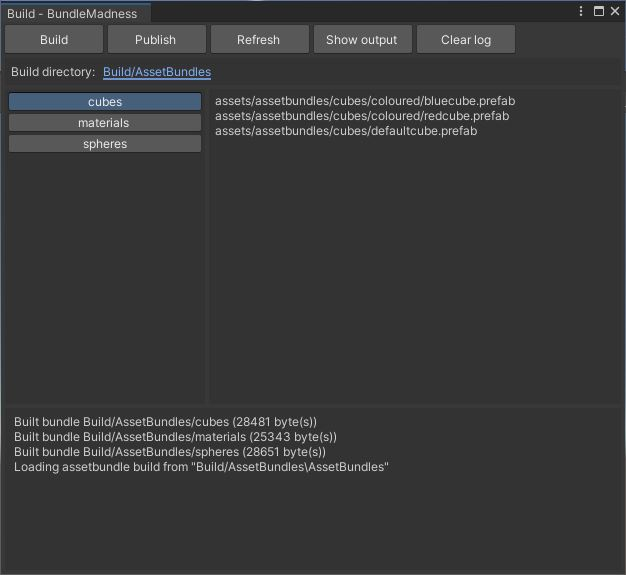

# Unity-BundleMadness
A simple tool to assist in workflows involving building asset bundles and publishing them via SSH.

CAUTION: This tool messes with filesystem contents locally and remotely without asking for confirmation for any action taken. It is up to you to provide correct settings (paths, etc.) If you don't, you will lose data. You have been warned.

DISCLAIMER: This is partly an experiment and partly the basis for an in-house tool. You should be using Addressables for this kind of functionality.

## Installation

Import the lastest release. Imported files are found under "Assets/Editor/ganast.com/BundleMadness".

The settings file will be created automatically with default settings.

The tool depends on [Json.NET](https://github.com/JamesNK/Newtonsoft.Json) and [SSH.NET](https://github.com/sshnet/SSH.NET). These are not included in releases.

## Configuration

Builds are created under "Build/AssetBundles" by default. The output folder can be selected via the tool's interface.

The tool expects to find assets to build in subfolders under "Assets/AssetBundles" by default. Each subfolder shall produce an individual asset bundle as part of a single build. To use another folder, edit the settings file.

Settings file location and other parameters can be modified in BundleMadnessConfig.cs.

## Building

Build asset bundles via the Build window.

