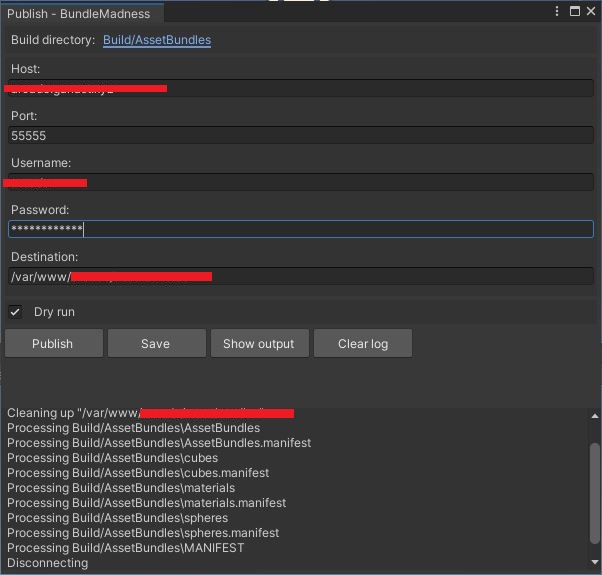

# Unity-BundleMadness
A simple tool to assist in workflows involving building asset bundles and publishing them via SSH.

CAUTION: This tool messes with filesystem contents locally and remotely without asking for confirmation for any action taken. It is up to you to provide correct settings (paths, etc.) If you don't, you will lose data. You have been warned.

DISCLAIMER: This is partly an experiment and partly the basis for an in-house tool. You should be using Addressables for this kind of functionality.

## Installation

Import the lastest release. Imported files are found under "Assets/Editor/ganast.com/BundleMadness".

The settings file will be created automatically with default settings.

The tool depends on [Json.NET](https://github.com/JamesNK/Newtonsoft.Json) and [SSH.NET](https://github.com/sshnet/SSH.NET). These are not included in releases.

## Configuration

Builds are created under "Build/AssetBundles" by default. The output folder can be selected via the tool's interface.

The tool expects to find assets to build in subfolders under "Assets/AssetBundles" by default. Each subfolder shall produce an individual asset bundle as part of a single build. To use another folder, edit the settings file.

Settings file location and other parameters can be modified in `BundleMadnessConfig.cs`.

## Building asset bundles

Build asset bundles via the Build window.


In addition to a regular build that consists of a number of asset bundles and a build bundle, a custom manifest shall also be created. That manifest is meant to assist in future remote access by providing information about published asset bundles and their contents and looks like this:

```
{
  "bundles": {
    "Cubes": [
      "Assets/AssetBundles/Cubes/DefaultCube.prefab",
      "Assets/AssetBundles/Cubes/Coloured/BlueCube.prefab",
      "Assets/AssetBundles/Cubes/Coloured/RedCube.prefab"
    ],
    "Materials": [
      "Assets/AssetBundles/Materials/Blue.mat",
      "Assets/AssetBundles/Materials/Green.mat",
      "Assets/AssetBundles/Materials/Red.mat"
    ],
    "Spheres": [
      "Assets/AssetBundles/Spheres/Coloured/DefaultSphere.prefab",
      "Assets/AssetBundles/Spheres/Coloured/GreenSphere.prefab",
      "Assets/AssetBundles/Spheres/Coloured/RedSphere.prefab"
    ]
  }
}
```

Note that the custom manifest does not include dependency information (for the time being). It is up to you to load asset bundles in the correct order.

You can inspect the contents of each asset bundle in the build folder with the buttons on the left.

Click on the folder link next to "Build directory" to select a different directory under which builds will be created. Button "Publish" opens the publish window. Button "Show output" opens the build folder.

## Publishing asset bundles

You can publish build asset bundles along with additional metadata to a remote destination via SSH.



Ensure that the specified user has appropriate access priviliges to the specified destination folder.

The remote destination folder's contents will be deleted before uploading.

The custom manifest as well as the build bundle and its manifest will also be uploaded.

NOTE: Only password-based authentication is supported at this time.

## Client API

The `BundleMadnessClient` class under the `com.ganast.jm.unity.BundleMadness` namespace provides a simple API for accessing remote asset bundles and metadata build and published via this tool. A sample scene illustrates various ways for discovering asset bundles and their contents, fetching asset bundles, loading assets and instantiating prefabs, along with some rudimentary caching. Some examples follow:

### Fetch build contents (via the build manifest)

This method requires that each individual asset bundle be loaded before its contents can be discovered:

TODO

### Fetch build contents (via the custom manifest)

This method allows for asset bundle contents discovery without the need to load each individual asset bundle before checking out its contents:

```
public void FetchManifest() {
    BundleMadnessClient client = BundleMadnessClient.GetInstance();
    client.SetURL("https://www.example.com/assetbundles");
    client.FetchManifest(OnManifestFetchSuccess);
}

public void OnManifestFetchSuccess(BundleMadnessManifest manifest) {
    foreach (string bundle in manifest.bundles.Keys) {
        Debug.Log(bundle);
        foreach (string asset in manifest.bundles[bundle]) {
            Debug.Log($"- {asset}");
        }
    }
    // todo: also save the manifest reference for future access...
}

```

### Load a remote asset bundle

```
public void FetchBundle() {
    BundleMadnessClient client = BundleMadnessClient.GetInstance();
    client.SetURL("https://www.example.com/assetbundles");
    client.FetchBundle("spheres", OnBundleFetchSuccess);
}

public void OnBundleFetchSuccess(AssetBundle bundle) {
    foreach (string asset in bundle.GetAllAssetNames()) {
        Debug.Log(asset);
    }
    // todo: also save the instance reference for future access...
}

```

### Load and instantiate a prefab

```
protected void SpawnRedSphere(AssetBundle spheresBundle) {
    string prefabPath = $"assets/assetbundles/spheres/coloured/redsphere.prefab";
    GameObject redSpherePrefab = spheresBundle.LoadAsset<GameObject>(prefabPath);
    Instantiate(redSpherePrefab);
}
```

## License

BundleMadness is licensed under the MIT License. See LICENSE.

## Copyright

(c) 2024 by ganast (ganast@ganast.com)
